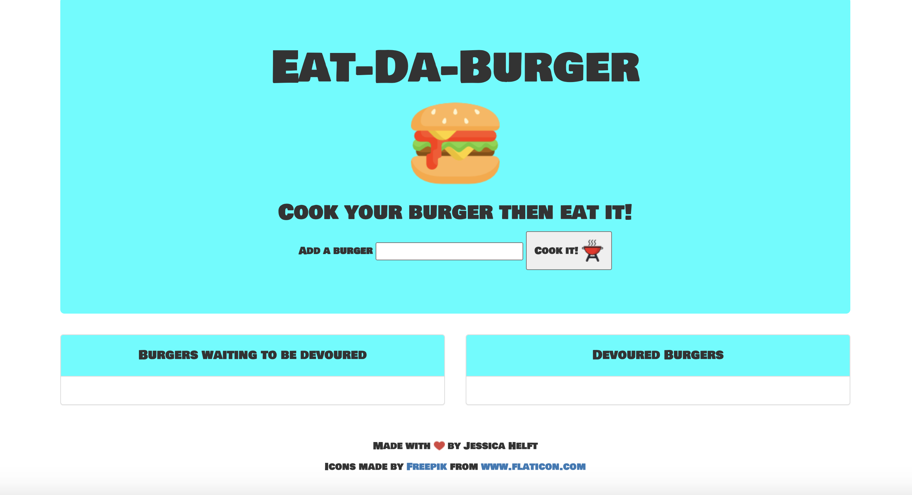
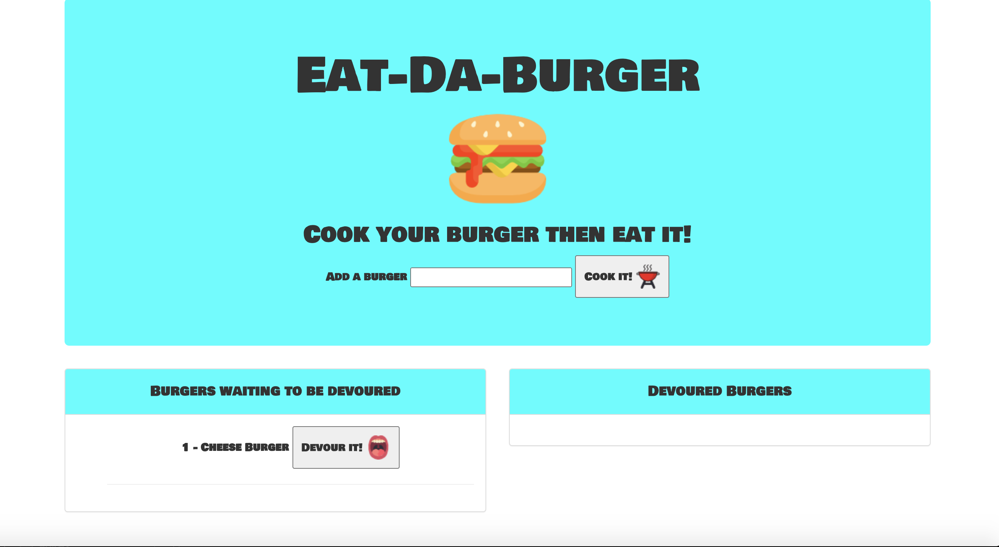
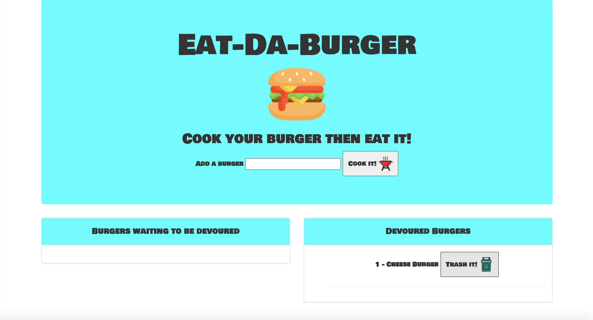

# **Eat-Da-Burger**
------

## **Contributors**

@KingKitty89

## **Description**

For this project I created a restaurant app that lets users input the names of burgers they would like to eat into an input field. When the user types the name of the burger into the input and clicks the "cook it" button the app will display the burger waiting to be devoured on the left side of the page. The user can then click the "devour it" button to eat the burger. Once the user devours the burger it will then display on the right side of the page, at that point the user can choose to throw it away by clicking the "trash it" button. Each burger is stored in a database, regardless of its devoured or not devoured state. This app uses hadlebars and shows how an ORM works.

## **Technology Stack**
* JavaScript
* Node.js
* Express
* HTML
* CSS
* Bootstrap
* Heroku
* Handlebars
* MySQL

## **Usage**

This application allows a user to keep track of the burgers they eat.

## **Contact**
* #### **Name:** Jessica Helft (@KingKitty89)
* #### **Email:** [jessicahelft@gmail.com](jessicahelft@gmail.com)
* #### **LinkedIn:** [LinkedIn](https://www.linkedin.com/in/jessicahelft)

## **Tests**

<h3 align ="center"><a href ="https://drive.google.com/file/d/1ThD33hf-y8Kt7DgdKItD3a7rpRX8lj-c/view">Live Demo</a></h3>

